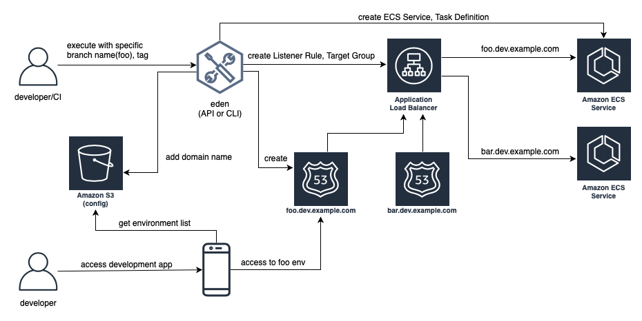

# aws-eden-cli: ECS Dynamic Environment Manager [](https://pypi.python.org/pypi/aws-eden-cli/)   


Clone Amazon ECS environments easily. 
Provide eden with a Amazon ECS service and eden will clone it. 

eden is provided in CLI and Terraform module (Lambda with HTTP API) flavors. 
You can use HTTP API from CI of your choice on Pull Request open/close, 
new commit pushes to fully automate environment creation. 
For API flavor, see eden API at [GitHub](https://github.com/baikonur-oss/terraform-aws-lambda-eden-api).

Works only with Python 3.6+.

## Developing with eden



## Requirements:
1. Config JSON file in a S3 bucket with structure described below
2. A reference ECS Service with Target Group Attached
3. An ALB with HTTPS Listener
    - Will be reused by all environments with Host Header Listener Rules
    - Separate from what reference service uses
    - Listener must have wildcard certificate for target dynamic zone
4. Simple ALB usage
    - No multiple path rules etc.
    - One ALB per one ECS Service

## What it does
### Resources created/deleted
eden creates
1. ECS Task Definition 
    -  Cloned from reference service
2. ALB (elbv2) Target Group 
    - Settings cloned from Target Group attached to reference service
3. ECS Service
    - Created in the same cluster as reference service
4. ALB Listener Rule
    - Host Header rule
5. Route 53 CNAME record
    - Points at common ALB
6. An entry is added to config JSON file

eden deletes resources in reverse order.

### Config JSON file
Config file is used to:
1. Check what environments exist and where their endpoints are
2. Tell client apps what is available

Config file format:
```json
{
    "environments": [
        {
            "env": "dev",
            "name": "dev-dynamic-test",
            "api_endpoint": "api-test.dev.example.com"
        }
    ]
}
```
Example above presumes `config_update_key = api_endpoint`. You can use multiple Lambdas/invoke eden-cli multiple times with different update keys to have multiple endpoints within single environment.

For example, you may want to have API, administration tool and a frontend service created as a single environment. Your environment file could look like this:
```json
{
    "environments": [
        {
            "env": "dev",
            "name": "dev-dynamic-test",
            "api_endpoint": "api-test.dev.example.com",
            "admin_endpoint": "admin-test.dev.example.com",
            "frontend_endpoint": "test.dev.example.com"
        }
    ]
}
```

## Usage (CLI interface)
### Installation
```
$ pip3 install aws-eden-cli 

$ eden -h
usage: eden [-h] [-p PROFILE] [-c CONFIG_PATH] [-v] {config,create,delete} ...

create similar ecs environments easily.

positional arguments:
  {config,create,delete}
    config              configure eden
    create              create environment or deploy to existent
    delete              delete environment

optional arguments:
  -h, --help            show this help message and exit
  -p PROFILE, --profile PROFILE
                        profile name in eden configuration file
  -c CONFIG_PATH, --config-path CONFIG_PATH
                        eden configuration file path
  -v, --verbose
```

### Configure
```
$ eden config --config-bucket-key endpoints.json
$ eden config --config-bucket-name servicename-config
$ eden config --config-update-key api_endpoint
$ eden config --config-name-prefix servicename-dev
$ eden config --domain-name-prefix api
$ eden config --dynamic-zone-id Zxxxxxxxxxxxx
$ eden config --dynamic-zone-name dev.example.com.
$ eden config --master-alb-arn arn:aws:elasticloadbalancing:ap-northeast-1:xxxxxxxxxxxx:loadbalancer/app/dev-alb-api-dynamic/xxxxxxxxxx
$ eden config --name-prefix dev-dynamic
$ eden config --reference-service-arn arn:aws:ecs:ap-northeast-1:xxxxxxxxxxxx:service/dev/dev01-api
$ eden config --target-cluster dev
$ eden config --target-container-name api

# you can also edit ~/.eden/config directly

$ cat ~/.eden/config
[default]
name_prefix = dev-dynamic
reference_service_arn = arn:aws:ecs:ap-northeast-1:xxxxxxxxxxxx:service/dev/dev01-api
target_cluster = dev
domain_name_prefix = api
master_alb_arn = arn:aws:elasticloadbalancing:ap-northeast-1:xxxxxxxxxxxx:loadbalancer/app/dev-alb-api-dynamic/xxxxxxxxxx
dynamic_zone_name = dev.example.com.
dynamic_zone_id = Zxxxxxxxxxxxx
config_bucket_name = servicename-config
config_bucket_key = endpoints.json
config_update_key = api_endpoint
config_env_type = dev
config_name_prefix = servicename-dev
target_container_name = api

# don't forget to check configuration file integrity

$ eden config --check
No errors found

# you can specify multiple profiles in configuration
# and select a profile with -p profile_name

$ eden config --check -p default
No errors found
```

### Execute commands
```
$ eden create --name test --cirn xxxxxxxxxxxx.dkr.ecr.ap-northeast-1.amazonaws.com/servicename-api-dev:latest
Checking if image xxxxxxxxxxxx.dkr.ecr.ap-northeast-1.amazonaws.com/servicename-api-dev:latest exists
Image exists
Retrieved reference service arn:aws:ecs:ap-northeast-1:xxxxxxxxxxxx:service/dev/dev01-api
Retrieved reference task definition from arn:aws:ecs:ap-northeast-1:xxxxxxxxxxxx:task-definition/dev01-api:15
Registered new task definition: arn:aws:ecs:ap-northeast-1:xxxxxxxxxxxx:task-definition/dev-dynamic-test:4
Registered new task definition: arn:aws:ecs:ap-northeast-1:xxxxxxxxxxxx:task-definition/dev-dynamic-test:4
Retrieved reference target group: arn:aws:elasticloadbalancing:ap-northeast-1:xxxxxxxxxxxx:targetgroup/dev01-api/9c68a5f91f34d9a4
Existing target group dev-dynamic-test not found, will create new
Created target group arn:aws:elasticloadbalancing:ap-northeast-1:xxxxxxxxxxxx:targetgroup/dev-dynamic-test/1c68c9e4c711a1f4
ELBv2 listener rule for target group arn:aws:elasticloadbalancing:ap-northeast-1:xxxxxxxxxxxx:targetgroup/dev-dynamic-test/1c68c9e4c711a1f4 and host api-test.dev.example.com does not exist, will create new listener rule
ECS Service dev-dynamic-test does not exist, will create new service
Checking if record api-test.dev.example.com. exists in zone Zxxxxxxxxxxxx
Successfully created CNAME: api-test.dev.example.com -> dev-alb-api-dynamic-xxxxxxxxx.ap-northeast-1.elb.amazonaws.com
Updating config file s3://servicename-config/endpoints.json, environment dev-dynamic-test: api_endpoint -> api-test.dev.example.com
Existing environment not found, adding new
Successfully updated config file
Successfully finished creating environment dev-dynamic-test

$ eden delete --name test
Updating config file s3://servicename-config/endpoints.json, delete environment dev-dynamic-test: api_endpoint -> api-test.dev.example.com
Existing environment found, and the only optional key is api_endpoint,deleting environment
Successfully updated config file
Checking if record api-test.dev.example.com. exists in zone Zxxxxxxxxxxxx
Found existing record api-test.dev.example.com. in zone Zxxxxxxxxxxxx
Successfully removed CNAME record api-test.dev.example.com
ECS Service dev-dynamic-test exists, will delete
Successfully deleted service dev-dynamic-test from cluster dev
ELBv2 listener rule for target group arn:aws:elasticloadbalancing:ap-northeast-1:xxxxxxxxxxxx:targetgroup/dev-dynamic-test/1c68c9e4c711a1f4 and host api-test.dev.example.com found, will delete
Deleted target group arn:aws:elasticloadbalancing:ap-northeast-1:xxxxxxxxxxxx:targetgroup/dev-dynamic-test/1c68c9e4c711a1f4
Deleted all task definitions for family: dev-dynamic-test, 1 tasks deleted total
Successfully finished deleting environment dev-dynamic-test
```


